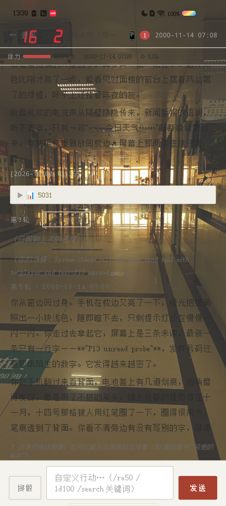
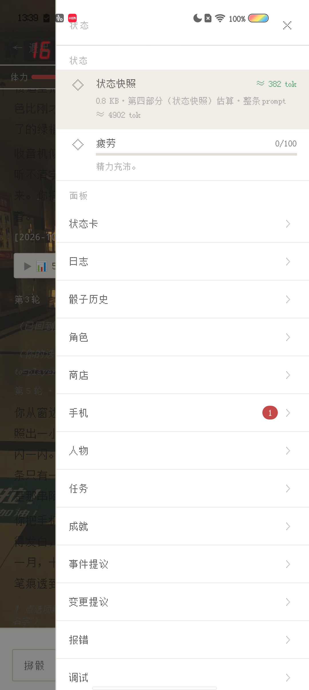
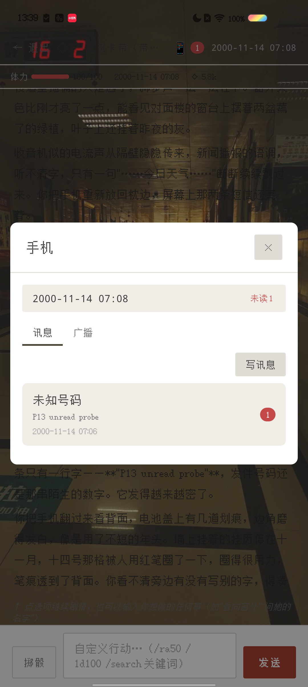
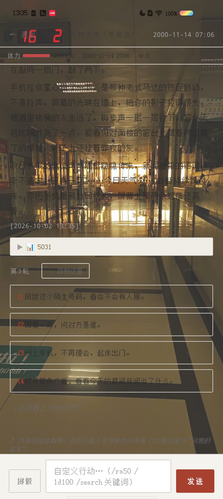
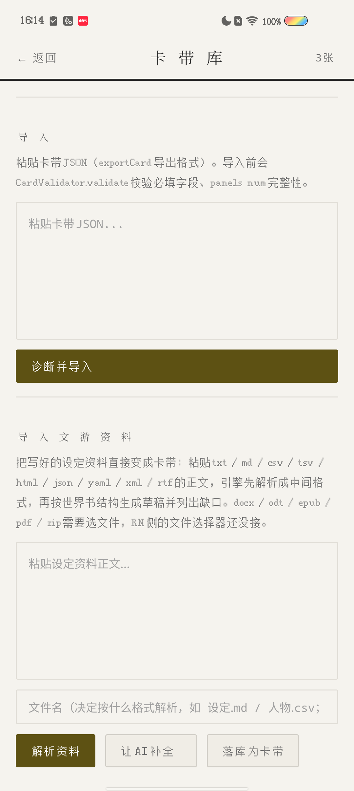
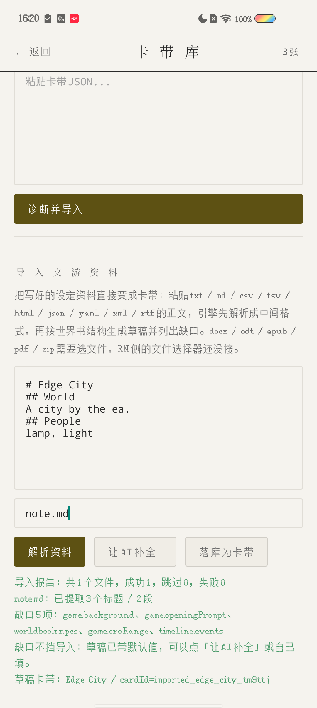

# 神秘小引擎（Hippocampus）

> 由AI制作，一个由外部环境权威限制AI过于自由的毛病的AI文游引擎，仅需自行输入API key接通AI后，根据界面指引于APK外的AI对话窗口转化文游指令为json指即可导入文游进行游玩，demo版本持续优化制作中。


一个**离线优先的 AI 文字冒险引擎**：你在手机或桌面上玩一场由大模型当主持人（GM）的文字游戏，剧本、NPC、世界状态由 AI 现场生成，而**存档、日志、骰子、信息层、世界书全部留在本机**，不依赖这台机器以外的任何服务器——除了你自己填的那个模型 API。

- **手机版**：React Native 0.87（本仓 `HippocampusRN`）
- **桌面版**：Electron（同一套 `engine/` 内核 + 纯 JS/DOM 外壳）
- **测试**：36 套 RN smoke 共 2474 条断言全绿；桌面版另有 14 项预检 + 47 套回归
- **版本**：1.2.0（本仓 `package.json` 与 `android/app/build.gradle` 的 `versionName` 同步为 1.2.0，`versionCode` 10200，已真机装机复核）

> 本仓是**手机版**。`engine/` 是两版共用的引擎内核（无 React Native 依赖，可纯 Node 跑），`rn/` 是手机壳。

---

## 手机直接下载安装（不用电脑）

**👉 [点这里下载最新 APK](https://github.com/AngryandfightingagainstAI/Hippocampus-core/releases/latest)**（当前 `v1.2.0`，62.95 MB，Android 7.0+）

1. 手机点开上面的链接，下载 `HippocampusRN-1.2.0-release-universal-p49.apk`。
2. 点开安装（首次要在系统里允许「安装未知来源应用 / 来自此来源的应用」）。
3. 打开 App → 设置里填**你自己的**模型 API key（OpenAI / DeepSeek / Gemini / 通义 等任意兼容接口）。
4. 首屏「导入卡带」粘贴或选择卡带 JSON，也可以直接用内置示例卡带先跑一把 → 开始叙事。

> 每个 Release 都会写明版本号（`versionName` / `versionCode`）与 APK 的 SHA256，可以自行核对。
> 只想玩的话到这里就够了；下面的「快速开始 / 打包 APK / 跑测试」是**开发者**从源码跑起来和编译的步骤，需要电脑。

---


- [手机直接下载安装（不用电脑）](#手机直接下载安装不用电脑)
- [它是什么](#它是什么)
- [截图](#截图)
- [功能清单](#功能清单)
- [快速开始](#快速开始)
- [打包 APK](#打包-apk)
- [跑测试](#跑测试)
- [项目结构](#项目结构)
- [数据落在哪里](#数据落在哪里)
- [接自己的 AI](#接自己的-ai)
- [已知限制](#已知限制)
- [致谢与许可](#致谢与许可)

---

## 它是什么

一句话：**把「跑团」交给 AI，把「记忆」留在你手机里。**

普通 AI 聊天玩文字冒险，玩到几十回合就会忘掉前面发生的事。这个引擎的做法是：

1. 每回合把**结构化状态快照**（HUD、侧栏、镜头内 NPC、手机未读、产出物、世界书命中项）拼进提示词，而不是把全部历史一股脑塞进去；
2. 历史过长时**自动把旧对话压缩成「日志」**（一次独立的 AI 调用产出 `title/summary/entities/tags/unresolved`），原文进 VFS 存档，摘要回灌提示词；
3. 提示词有**预算刹车**：估算超预算就按 6 档逐级降级（保留最近 1 条 → 裁到 2 条 → 收敛查询 → … → 摘要降到 0），并把「已降级 N 档」显示在侧栏；
4. AI 通过 `<<<TOOL>>>{...}<<<END>>>` 调用**受白名单约束的工具**（改数值、加物品、掷骰、查 NPC、发手机讯息、触发事件……），所有状态变更都走这一条通道，可回放、可审计。

---

## 截图

| 叙事页（顶栏 📱 未读徽标） | 侧栏（手机入口徽标 + 预算估算） |
|---|---|
|  |  |

| 手机面板（剧情外信息层） | 冷启动续玩 |
|---|---|
|  |  |

| 导入文游资料 | 解析报告与缺口清单 |
|---|---|
|  |  |

---

## 功能清单

### 叙事与 AI

- **流式回合制叙事**：`【正文】+【时间】+【选项】` 协议解析；选项按钮 / 自定义行动输入；`🔁 重新生成`（仅最新轮）与 `↩ 回到这里`（快照回退）。
- **思考链展示**：`reasoning_content`、联网搜索结果、token 用量三块可分别开关（`filterThinkingMeta`），渲染成可折叠的「思考块」。
- **提示词预算刹车**：`estimateTokens` 估算 → 6 档降级 → 侧栏显示 `≈ N tok` 与「⚠ 预算超限，已降级 N 档」。
- **自动日志压缩**：跨天或累积满阈值时把旧对话压成日志；失败保留原文并提示。
- **前情回灌**：最近的日志摘要（默认 3 条）+ 相关 NPC + 未完成事项自动进系统状态快照。
- **`query_log` 关键词检索**：摘要被降级到 0 时仍留一句提示，AI 可以自己去翻原文。

### 工具调用（AI 能改世界的唯一通道）

- 同步白名单 18 项：`modify_hud`、`modify_sidebar`、`modify_entry`、`modify_relation`、`add_item`、`remove_item`、`query_player`、`query_npc`、`query_faction`、`query_map`、`query_worldsetting`、`roll_dice`、`roll_check`、`roll_opposed`、`web_search`、`set_location`、`list_destinations`。
- 另有 62 项由各 `engine/` 模块注册（与内置 18 项合计 **80 项**）：`open_shop`/`buy_item`/`sell_item`、`trigger_event`、`add_task`/`complete_task`、成就、结局、剧情节点、`propose_change`、`info_send`/`info_broadcast`/`info_read`/`info_promote`、立绘等。**全部在模块加载时同步挂上，没有启动空窗**——以前这批工具是 `setTimeout` 错峰注册的，冷启动头两秒 AI 调用它们会被判「未知工具」。
- **超长工具块保护**：单个工具块超过 12000 字符时**保留原文但不执行**，并在叙事流给出可见信号，避免截断造成状态错乱。
- **查询结果结构化截断**：`query_*` 回显超过 800 字符时摘关键字段；`query_player` 回显剔除立绘与开场提示词。

### 剧情外信息层（「小手机」）

- AI 在**空闲期**可以主动给玩家发讯息 / 发广播（每 25 游戏分钟一次冷却 + 25% 概率，不是每回合都发）。
- **首条有触达保证**：玩家还没收到过任何信息时，从第 3 回合起不再掷概率闸（冷却与每回合上限仍然生效），保证第一条讯息一定会来。
- 短信只在手机里，默认**不进正文**；带 `importance:'actionable'` 作建议，或用 `info_promote(id)` 升级进正文；**玩家在手机上点「跟进正文」优先**。
- 未读徽标三处可见：顶栏 📱+N、侧栏「手机」入口徽标、面板内每线程 `●N`；超过 99 显示 `99+`。
- 打开面板**不清零**，进具体线程才 `markRead`——避免玩家没看内容就把红点消掉。

### 世界与角色

- **世界书（World Book）** 12 个子编辑器：世界观、NPC、种族、职业、技能、物品、商店、势力、货币、地图、时间线、产出物。
- **角色卡带（卡带/Card）**：多卡带、卡带校验、卡带分类（`classify.js`）、卡带诊断。
- **NPC 自主性**：NPC 有独立的知识来源（`witness/told/rumor/public/deduced/misconception/manual/legacy`）与推理链，可以拒绝、误解、忽略玩家，玩家离开后继续行动。
- **主体边界**：引擎级规则禁止 AI 替玩家写「想了什么 / 感受到什么 / 决定了什么」；NPC 规则明确「可以行动 ≠ 必须行动」。

### 导入文游资料

已经写好一堆设定、但不想手搓卡带 JSON 时用这条路：**把原始资料丢进去 → 引擎解析 → 生成卡带草稿 → AI 补缺口 → 落库**。入口在卡带库的「导入文游资料」。

- **支持 22 种格式**：纯文本 / Markdown / CSV / TSV / JSON / YAML / XML / HTML / RTF 直接解析；**docx / odt / epub / PDF / ZIP 走文档解析**（不依赖任何第三方解析库，ZIP 与 inflate 是自实现的纯 JS）。
- **原件单独保管**：解析前先把原文件（连同 sha256）存进 `vfs:/imports/<importId>/`，AI 的转换结果另存一份。**转换错了可以回溯原始资料**，不会被 AI 的改写覆盖。
- **永不静默丢内容**：认不出格式 / 解析失败 / 格式不支持，一律降级成「原文保留 + 报告里写明原因」，不会悄悄吞掉你的资料。
- **草稿一定带缺口清单**：按表头/小节标题把表格映射到 NPC / 势力 / 物品 / 技能 / 商店 / 职业 / 种族 / 任务 / 成就 / 事件；认不出的会列成「缺口」而不是假装填好了。
- **让 AI 补全**：把缺口和允许的补丁结构发给 AI，只接受白名单字段的补丁（`__inject` 之类的注入被丢弃），补完自动跑卡带校验，最多 3 轮。**没过校验不允许落库。**
- **诚实边界**：加密 PDF 会明确报「已加密」；有页面但抽不到文字的 PDF 会报「极可能是扫描件，需要 OCR」，不会假装读到了内容。

### 系统与运营

- **存档**：分片存储、快照（默认保留最近 30 个）、按轮次回退、断点续玩。
- **骰子**：`1d100` 等表达式、对抗检定、骰子历史、手动掷骰、`/ra50` `/1d100` 简写。
- **状态卡**：HUD + 侧栏 + 多组面板数据（属性 / 名声 / 社交 / 世界），支持自定义数值编辑器（`templates/number.js`、`relation.js`）。
- **实时系统**：游戏内时钟、天气、节日（不含农历）。
- **产出物发酵**：玩家产出的东西会在后续回合逐渐发生变化。
- **元层提议**：AI 可以提出变更提议 / 事件提议，玩家批准才生效（`ProposalValidator` + 语义检查）。
- **报错面板 + 日志检索**：所有引擎异常进 ErrorLog，可在面板里查，也能按关键词检索历史日志。
- **设置十页**：AI / 搜索 / 通用 / 骰子 / 天气 / 实时 / 编辑器 / 世界书 / 数据 / GM。

---

> ⚠️ 下面「快速开始 / 打包 APK」是**开发者**用的（需要电脑 + Node 22 / JDK 17 / Android SDK）。只想在手机上玩，请看最上面的「[手机直接下载安装（不用电脑）](#手机直接下载安装不用电脑)」。


### 环境要求

| 依赖 | 版本 |
|---|---|
| Node.js | ≥ 22.11（`package.json` engines） |
| JDK | 17（`JAVA_HOME` 指向 JDK 17） |
| Android SDK | `ANDROID_HOME` + platform-tools + build-tools |
| React Native CLI | 随 `@react-native-community/cli 20.2.0` 自带 |

JavaScript 引擎全在仓库里，**不需要额外下载模型或数据**。

### 安装依赖

```sh
npm install
```

### 开发模式运行（连真机 / 模拟器）

```sh
# 终端 1：起 Metro
npm start

# 终端 2：装到设备
npm run android
```

> 装 APK 到 vivo 等国产 ROM 时，请用 `adb install -r -i com.android.vending`，否则会被 `PackageInterceptActivity` 拦住。

---

## 打包 APK

```sh
cd android
./gradlew assembleRelease      # Windows: gradlew.bat assembleRelease
```

产物：

```
android/app/build/outputs/apk/release/app-release.apk
```

`assets/index.android.bundle` 是 Hermes 字节码（Metro 打包产物），所以直接对 APK 搜中文会搜不到——属正常现象。

---

## 跑测试

测试**不依赖真机**，全是 Node 跑的 smoke（少量用仓内 babel 做 JSX 语法校验）：

```sh
node tools/cards_smoke.js           # 以及 tools/ 下其余 25 套
node tools/p10_smoke.js
node tools/info_phone_smoke.js
node tools/settings_smoke.js
node tools/longline_token_smoke.js
```

当前基线：**26 套 / 2061 ok / 0 failed**。

> ⚠️ 必须在仓库根目录下跑（部分套件对 `cwd` 敏感）。

引擎本身也能离开 React Native 跑：`engine/` + `vfs/` 在纯 Node 下可加载（只有 `rn/export_util.js`、`rn/rn_platform.js`、`rn/use_theme.js` 三个文件 `require('react-native')`），因此可以做无头回合驱动测试。

---

## 项目结构

```
HippocampusRN/
├── App.tsx                 路由根（home/story/settings/cards/saves/create/portrait/classify）
├── engine/                 引擎内核（与桌面版共用，无 RN 依赖）
│   ├── core/               gamestate / prompt_builder / tool_executor / api_client / storage / saves …
│   ├── story.js            StoryLoop（回合主循环）+ CreateFlow（创角流程）
│   ├── info_feed.js        剧情外信息层（手机）
│   ├── npc_runtime.js      NPC 运行时、知识来源
│   ├── snapshots.js        快照与回退
│   ├── import/             导入文游资料（22 种格式 → 中间格式 → 卡带草稿；与桌面版共用）
│   ├── worldbook / wb/     世界书数据层
│   └── …                   events / tasks / achievements / endings / shop / dice / weather / proposals …
├── vfs/                    存储抽象层
│   ├── vfs.js              路径化 KV（前缀 vfs:）
│   ├── storage_adapter.js  真机 op-sqlite / 兜底 localStorage
│   ├── saves.js            存档
│   └── logger.js           日志与压缩
├── rn/                     手机壳（React Native）
│   ├── screens/            StoryScreen / HomeScreen / SettingsScreen / CreateScreen …
│   │   └── settings/       十个设置页 + worldbook 的 12 个子编辑器
│   ├── components/         SidebarDrawer / PanelHost / ThinkingBlock / InfoPhonePanel …
│   ├── panels/             15 个面板 + panel_data.js
│   ├── rn_platform.js      引擎 → 平台桥（Platform.ui.*）
│   └── rn_bootstrap.js     按序加载 63 个引擎模块
├── tools/                  26 套 smoke 测试
└── docs/                   报告与真机截图
```

---

## 数据落在哪里

- 真机：SQLite 数据库 `hippocampus_vfs.db`，表 `kv(k, v)`，所有路径以 `vfs:` 为键前缀。
- 键结构示例：`vfs:/saves/<cardId>/<saveId>/{meta,player,npc_runtime,chat/index,...}.json`。
- 日志：`vfs:/saves/<cardId>/<saveId>/logs/<年>/<月>/W<周>/<日期>.json`，另有 `_week.json` 索引。
- **一切都在本机**。唯一的对外请求是你自己配置的模型 API 与（可选的）联网搜索。

---

## 接自己的 AI

设置 → 🤖 AI → 添加配置，填 `baseUrl` / `model` / `apiKey`：

- 兼容 OpenAI Chat Completions 格式的**任何**端点（官方、中转、本地 Ollama / llama.cpp / vLLM 都行）。
- 本地地址（`localhost` / `127.0.0.1` / `::1` / 内网段）**免 Key**。
- 支持 JSON mode；模型不支持时自动降级重试一次。
- 「最大输出」建议 ≥ 8192：思考模型会把 `reasoning_content` 和正文共用一个 completion 预算，调小了正文会被挤掉（引擎检测到空正文会直接提示你去调高）。
- 可选填搜索 API，AI 就能用 `web_search` 工具。

---

## 已知限制

- **Android 优先**：`android/` 完整可打包，iOS 未做验证。
- **信息层仍是概率性的**（25 分钟冷却 + 25%），所以「连着好些回合没有短信」是正常表现；只有**第一条**有触达保证。
- **农历节日不做**（每年日期不同，引擎暂不支持）。
- **导入文游资料**在手机版目前只能**粘贴文本类资料**；docx / odt / epub / PDF / ZIP 需要「选文件」，RN 侧的文件选择器还没接（桌面版已可直读本地文件）。
- **创角流程**、**结局触发**、**元层提议**的自动化覆盖较薄，主要靠人工真机验证。
- 设置页「未保存就切 tab」目前只拦**涉及世界书的切换**（从世界书离开、或切进世界书时弹确认）；其他页之间切换仍不拦，因为那些页是即时生效的。

---

## 致谢与许可

- 引擎、桥接层与 UI 壳为本项目自研。
- 运行时依赖：React Native、`@op-engineering/op-sqlite`、`react-native-mmkv`、`react-native-image-picker`、`react-native-safe-area-context`。

> 仓库当前未附 LICENSE。若打算公开分发，建议先补一个（MIT / Apache-2.0 / 私有均可），并确认所引用的卡带素材（若有）的授权。
